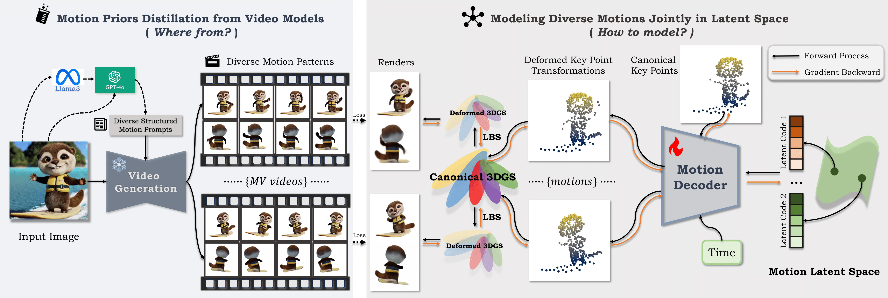

## DIMO: Diverse 3D Motion Generation for Arbitrary Objects

### [Paper](https://arxiv.org/pdf/2511.07409) | [Project Page](https://linzhanm.github.io/dimo/) | [Demo](https://youtu.be/CY2jTIpEN-I) | [Poster](https://iccv.thecvf.com/media/PosterPDFs/ICCV%202025/1183.png?t=1755853954.3028586)

> DIMO: Diverse 3D Motion Generation for Arbitrary Objects \
> [Linzhan Mou](https://linzhanm.github.io/), [Jiahui Lei](https://www.cis.upenn.edu/~leijh/), [Chen Wang](https://cwchenwang.github.io/), [Lingjie Liu](https://lingjie0206.github.io/), [Kostas Daniilidis](https://www.cis.upenn.edu/~kostas/) \
> University of Pennsylvania \
> ICCV 2025 **(Highlight)**

<div align="center">
    
</div>

### 📜 News

- **[2026-01-04]** Code and data are pre-released!
- **[2025-07-24]** DIMO is selected as Highlight Paper!
- **[2025-06-26]** DIMO is accepted by ICCV 2025! 🎉 We will release code in this repo.

### ⚙️ Installation
We use Python 3.10 with PyTorch 2.1.1 and CUDA 11.8. The environment and packages can be installed as follows:
```bash
git clone --recursive https://github.com/Friedrich-M/DIMO.git && cd DIMO
conda create -y -n dimo -c nvidia/label/cuda-11.8.0 -c defaults cuda-toolkit=11.8 cuda-compiler=11.8 cudnn=8 python=3.10
conda activate dimo
pip install torch==2.1.1 torchvision==0.16.1 torchaudio==2.1.1 --index-url https://download.pytorch.org/whl/cu118
pip install -r requirements.txt --no-build-isolation

pip install --no-cache-dir pytorch3d -f https://dl.fbaipublicfiles.com/pytorch3d/packaging/wheels/py310_cu118_pyt211/download.html
pip install git+https://github.com/rahul-goel/fused-ssim/ --no-build-isolation
pip install submodules/diff-gauss submodules/diff-gaussian-rasterization submodules/KNN_CUDA submodules/simple-knn --no-build-isolation
```

### 📂 Data Preparation
Intuition: distill rich motion priors from video models as diverse motion capture.

- Motion Priors Distillation

- - We use text-conditioned monocular videos models ([[CogVideoX](https://github.com/zai-org/CogVideo)], [[Wan2.2](https://github.com/Wan-Video/Wan2.2)], [[HunyuanVideo](https://github.com/Tencent-Hunyuan/HunyuanVideo)], etc.) to distill rich motion priors. We will add detailed instructions soon.

- Geometry Priors Distillation
- - We use multi-view video model ([[SV3D](https://github.com/Stability-AI/generative-models)], [[SV4D](https://github.com/Stability-AI/generative-models)]) to obtain geometric priors by generating novel views.

You can skip this step and download our processed example data (51 Trump motions) from [Google Drive](https://drive.google.com/file/d/1b0_2t_KKhOyKlJsYncUcQm6URecAS6M6/view?usp=drive_link):
```bash
mkdir data && cd data && gdown 1b0_2t_KKhOyKlJsYncUcQm6URecAS6M6 && tar -zxvf data_trump_n51_step20.tar.gz && cd ..
```

### 🚀 Training
Intuition: jointly model diverse 3D motions in a shared latent space. To train DIMO, simply run:
```bash
sh run_train_latent.sh
```
- **NOTE:** You can modify the hyperparameters in `run_train_latent.sh` as needed. Check `configs/train_config.yaml` to view all configurable parameters and default settings
- **NOTE:** Set the `vae_latent` flag to `True` to enforce a Gaussian distribution on the motion latent code, which also enables KL divergence loss during training.

### ✨ Testing

You can also skip training and download our pre-trained model from [Google Drive](https://drive.google.com/file/d/1-a9JxXvoGRV_qy5ontRShc4mgDgVkrsd/view?usp=drive_link) for testing:
```bash
mkdir ckpts && cd ckpts && gdown 1-a9JxXvoGRV_qy5ontRShc4mgDgVkrsd && tar -zxvf ckpt_trump_n51_step20.tar.gz && cd ..
```

Once trained, you can perform 4d rendering and visualize key point trajectories by running:
```bash
sh run_test_motion.sh
```
- **NOTE:** You can specify rendering motions by modifying the `render_videos` list in `run_test_motion.sh`; uncomment the corresponding lines to render all motions (it may take some time).

The rendered key point trajectories will look like this (Trump is walking):

https://github.com/user-attachments/assets/6b51b897-ed89-470a-b5e9-b6cb01ccecf0

The 4d rendering results should look like this (reference, fixed view, orbit views):

https://github.com/user-attachments/assets/b7a5c7fd-4d35-4d66-b284-092398f6a29c

- **NOTE:** Since the video models we use for motion prior distillation were not perfect at that time, the generated videos may contain artifacts. We will update the code and models with more advanced video models like Veo3 and SV4D2.0 in the future. 

If you have any questions, please feel free to open an issue or email at  `linzhan@princeton.edu`.

### 🚦 Applications

With the learned motion latent space, we provide scripts to test the following applications. Simply add the corresponding flags in `run_test_motion.sh` and run it. We also provide some visualization results below. More instructions will be added soon.

- Latent Space Motion Interpolation

Add `test_interpolation=True` in `run_test_motion.sh`

https://github.com/user-attachments/assets/1d2d1173-cfbd-420d-96fb-eb806ab62c33

- Language-Guided Motion Generation

Add `test_language=True` in `run_test_motion.sh`

https://github.com/user-attachments/assets/9cbadd77-2b39-48b9-b73d-4d71fcf5b2fb

- Test Motion Reconstruction

Add `test_motion=True` in `run_test_motion.sh`

https://github.com/user-attachments/assets/e2e3c1aa-a47b-4cee-8301-12ae9be804eb

### 🌸 Acknowledgement
Our code is built on top of [DreamGaussian](https://github.com/dreamgaussian/dreamgaussian), [CogVideoX](https://github.com/zai-org/CogVideo), [SV4D](https://github.com/Stability-AI/generative-models). Many thanks to the authors for sharing their code. We also greatly appreciate the help from [Yiming Xie](https://ymingxie.github.io/).

### 📝 Citation

If you find this paper useful for your research, please consider citing:

```
@inproceedings{mou2025dimo,
  title={DIMO: Diverse 3D Motion Generation for Arbitrary Objects},
  author={Mou, Linzhan and Lei, Jiahui and Wang, Chen and Liu, Lingjie and Daniilidis, Kostas},
  booktitle={Proceedings of the IEEE/CVF International Conference on Computer Vision},
  pages={14357--14368},
  year={2025}
}
```
