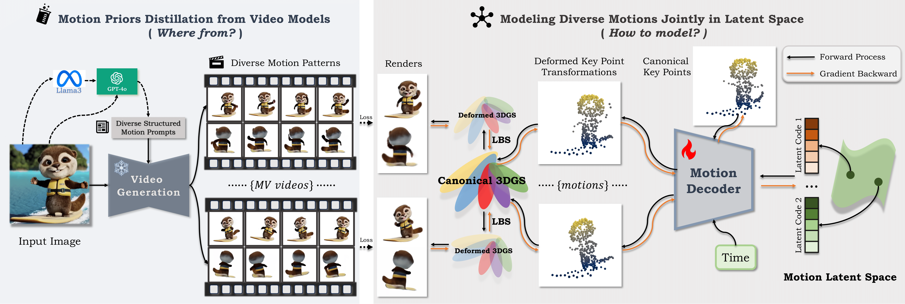

## DIMO: Diverse 3D Motion Generation for Arbitrary Objects

### [Paper](https://arxiv.org/pdf/2511.07409) | [Project Page](https://linzhanm.github.io/dimo/) | [Demo](https://youtu.be/CY2jTIpEN-I) | [Poster](https://iccv.thecvf.com/media/PosterPDFs/ICCV%202025/1183.png?t=1755853954.3028586)

> DIMO: Diverse 3D Motion Generation for Arbitrary Objects \
> [Linzhan Mou](https://linzhanm.github.io/), [Jiahui Lei](https://www.cis.upenn.edu/~leijh/), [Chen Wang](https://cwchenwang.github.io/), [Lingjie Liu](https://lingjie0206.github.io/), [Kostas Daniilidis](https://www.cis.upenn.edu/~kostas/) \
> University of Pennsylvania \
> ICCV 2025 **(Highlight)**

<div align="center">
    
</div>

### 📜 News

- **[2026-01-04]** Code and data are pre-released!
- **[2025-07-24]** DIMO is selected as Highlight Paper!
- **[2025-06-26]** DIMO is accepted by ICCV 2025! 🎉 We will release code in this repo.

### ⚙️ Installation
We use Python 3.10 with PyTorch 2.1.1 and CUDA 11.8. The environment and packages can be installed as follows:
```bash
git clone --recursive https://github.com/Friedrich-M/DIMO.git && cd DIMO
conda create -y -n dimo -c nvidia/label/cuda-11.8.0 -c defaults cuda-toolkit=11.8 cuda-compiler=11.8 cudnn=8 python=3.10
conda activate dimo
pip install torch==2.1.1 torchvision==0.16.1 torchaudio==2.1.1 --index-url https://download.pytorch.org/whl/cu118
pip install -r requirements.txt --no-build-isolation

pip install --no-cache-dir pytorch3d -f https://dl.fbaipublicfiles.com/pytorch3d/packaging/wheels/py310_cu118_pyt211/download.html
pip install submodules/diff-gauss submodules/diff-gaussian-rasterization --no-build-isolation
```
Two rasterizers are needed: `diff-gauss` renders depth and normals (used when `add_normal=True`, the default) and `diff-gaussian-rasterization` is the plain fallback. Nearest-neighbour queries use PyTorch3D.

<details>
<summary>Build and offline-cache notes (clusters, air-gapped compute nodes)</summary>

`requirements.txt` pins `setuptools<70` because the extension builder of PyTorch 2.1.1 still imports `pkg_resources`. When compiling the rasterizers on a machine without a GPU (e.g. a cluster login node), set the target architectures explicitly, e.g. `TORCH_CUDA_ARCH_LIST="8.0;9.0"` for A100/H100.

Three model weights are downloaded on first use, which fails on compute nodes without outbound internet access. Fetch them once from a machine that has it, then point the code at the cache:
```bash
python -c "import lpips; lpips.LPIPS(net='vgg')"                                # LPIPS VGG, into the package dir
python -c "from rembg import new_session; new_session('u2net')"                 # rembg matting, into ~/.u2net
python -c "from transformers import AutoModel, AutoTokenizer; [c.from_pretrained('bert-base-cased', cache_dir='ckpts/hf_cache') for c in (AutoTokenizer, AutoModel)]"
```
Then pass `bert_cache_dir=ckpts/hf_cache` to `test.py mode=language` and `projector.bert_cache_dir=ckpts/hf_cache` to `train_text_projector.py`. Also export `HF_HUB_OFFLINE=1` on the compute node: with a cache directory set, transformers still contacts the hub first and spends about half a minute in retries before falling back to it. `rembg` is pinned to `u2net`; override with `$DIMO_REMBG_MODEL` if you cached a different one.
</details>

### 🗂️ Code Structure
```
train.py / test.py        entry points (config = configs/default.yaml + key=value overrides)
configs/default.yaml      every option, documented
scripts/                  example train / test commands
dimo/
  data.py                 multi-view video loading, mask caching (rembg)
  cameras.py              orbit cameras and the rasterizer camera
  trainer.py              two-stage training loop
  tester.py               rendering, trajectories and the latent-space applications
  models/
    deform_net.py         latent-conditioned motion decoder (position + rotation)
    latent.py             per-motion latent codes (plain or Gaussian / VAE)
    gaussian_model.py     canonical Gaussians, key points, densification, checkpoints
    renderer.py           stage-1 / stage-2 deformation and rasterisation
    text_encoder.py       BERT -> latent projector for language-guided generation
  losses/                 image losses, depth / normal smoothness, ARAP, KL, Chamfer
  utils/                  I/O, trajectory visualisation, math helpers
data_generation/          single image -> training data (see its own README)
```

### 📂 Data Preparation
Intuition: distill rich motion priors from video models as diverse motion capture.

[`data_generation/`](data_generation/README.md) implements the full pipeline of Sec. 3.1 of the paper: from a **single image** it writes the exact folder layout `train.py` expects, in five resumable stages (captions, image-to-video, filtering, multi-view lifting, dataset assembly).

```bash
cd data_generation && bash scripts/run_pipeline.sh trump /path/trump.png
```
See [`data_generation/README.md`](data_generation/README.md) for the stages, the environments, the checkpoints to download and all options.

You can skip this step and download our processed example data (51 Trump motions) from [Google Drive](https://drive.google.com/file/d/1b0_2t_KKhOyKlJsYncUcQm6URecAS6M6/view?usp=drive_link):
```bash
mkdir data && cd data && gdown 1b0_2t_KKhOyKlJsYncUcQm6URecAS6M6 && tar -zxvf data_trump_n51_step20.tar.gz && cd ..
```
A data folder contains one sub-folder per motion with `view_XX/FF.png` frames, plus an optional `info.json` listing the view azimuths and the motion names. Foreground masks are computed on first use and cached next to the frames as `FF_mask.npy`, so only the first run pays for them; the loader spreads the work over `num_workers` processes.

`mask_method` chooses how. The default `rembg` runs the u2net matting network, which is general but costs about 0.2 s per frame — roughly 27 minutes for a 51 x 9 x 21 dataset on one core, or under 2 minutes on 16. Since every frame this pipeline produces sits on a pure white background, `mask_method=white_bg` instead derives the alpha from the distance to white, which is **about 30x faster** (a full dataset in under a minute on one core) and keeps white parts of the object, because it only removes white that is connected to the image border. It agrees with `rembg` to a median IoU of 0.97; the difference is at soft edges, where `white_bg` keeps a slightly wider matte. Use it for renders on white, and keep `rembg` for photographs or any other background. If you precompute masks with `data_generation/build_dataset.py`, set the matching `dataset.mask_method` there so the cached masks are the ones training would have produced.

### 🚀 Training
Intuition: jointly model diverse 3D motions in a shared latent space. To train DIMO, simply run:
```bash
bash scripts/train.sh            # or: python train.py input_folder=data/trump_n51_step20 save_path=outputs/trump_n51_step20 ...
```
- **NOTE:** All hyperparameters live in `configs/default.yaml` and can be overridden on the command line as `key=value`; `scripts/train.sh` shows the settings used for the example data.
- **NOTE:** Set `vae_latent=True` to enforce a Gaussian distribution on the motion latent code, which also enables the KL divergence loss during training.
- **NOTE:** Training runs in two stages (`s1`: motion pre-training on key points, `s2`: joint refinement). Pass `load_stage=s1` to resume from a saved stage-1 checkpoint. Checkpoints and tensorboard logs are written to `save_path`.

### ✨ Testing

You can also skip training and download our pre-trained model from [Google Drive](https://drive.google.com/file/d/1-a9JxXvoGRV_qy5ontRShc4mgDgVkrsd/view?usp=drive_link) for testing:
```bash
mkdir ckpts && cd ckpts && gdown 1-a9JxXvoGRV_qy5ontRShc4mgDgVkrsd && tar -zxvf ckpt_trump_n51_step20.tar.gz && cd ..
```

Once trained, you can perform 4d rendering and visualize key point trajectories by running:
```bash
bash scripts/test.sh             # or: python test.py mode=render input_folder=... save_path=... video_save_dir=...
```
- **NOTE:** Choose which motions to render with `render_videos=11-walk` (comma-separated list); pass `render_videos=null` to render all motions (it may take some time). For every motion you get the reference-view video (`*_ref.mp4`), an orbit video (`*_orbit.mp4`), the key-point trajectories overlaid on the render (`*_blend.mp4`), a 3D trajectory animation (`*_traj_3d.mp4`) and trajectory images; `render_views=True` additionally renders all training views.

The rendered key point trajectories will look like this (Trump is walking):

https://github.com/user-attachments/assets/6b51b897-ed89-470a-b5e9-b6cb01ccecf0

The 4d rendering results should look like this (reference, fixed view, orbit views):

https://github.com/user-attachments/assets/b7a5c7fd-4d35-4d66-b284-092398f6a29c

- **NOTE:** Since the video models we use for motion prior distillation were not perfect at that time, the generated videos may contain artifacts. We will update the code and models with more advanced video models like Veo3 and SV4D2.0 in the future.

If you have any questions, please feel free to open an issue or email at `linzhan@princeton.edu`.

### 🚦 Applications

With the learned motion latent space, the same `test.py` entry point exposes the following applications through the `mode` option (`bash scripts/test.sh <mode> [key=value ...]`). We also provide some visualization results below.

They all render through the key-point motion model, so they need a stage-2 checkpoint (`test_stage=s2`, the default in `scripts/test.sh`).

- Latent Space Motion Interpolation

`mode=interpolation interp_videos=[04-032041,11-raise] interp_alpha=0.5`

Blends the two motions' latent codes and renders the result. `interp_alpha` also takes a list, and the default `[0.0, 0.5, 1.0]` renders both endpoints and the midpoint and additionally writes them side by side as `intp_<a>_<b>_sweep_frames.mp4`, so the path through the latent space can be read at a glance. Values outside `[0, 1]` extrapolate past an endpoint.

https://github.com/user-attachments/assets/1d2d1173-cfbd-420d-96fb-eb806ab62c33

- Language-Guided Motion Generation

`mode=language test_text_prompt="Trump is walking" text_encoder_ckpt=<projector.pth>`

Maps a phrase to a latent code with a small BERT-to-latent projector. **The released checkpoint does not include a projector**, so train one first — it takes a couple of minutes on CPU:
```bash
python data_generation/train_text_projector.py --config data_generation/configs/default.yaml \
    object.name=trump_n51_step20 dataset.output_dir=data \
    projector.checkpoint_dir=ckpts/trump_n51_step20/s2
```
To train the projector for your own object, run the same script against your trained checkpoint; it pairs each motion's short phrase from `captions.json` with that motion's latent code, using the `motion_order.json` the training run wrote so the pairing cannot silently shift. A dataset that arrived without captions (such as the released Trump data) can be captioned first with `data_generation/caption_dataset.py dataset_dir=data/trump_n51_step20`, which shows a strip of frames per motion to a vision-language model and writes the `captions.json` the projector needs.

https://github.com/user-attachments/assets/9cbadd77-2b39-48b9-b73d-4d71fcf5b2fb

- Test Motion Reconstruction

`mode=fit_motion test_motion_data=<folder with view_XX/FF.png of the new motion>` fits a new latent code to an unseen multi-view video, keeping the geometry and the motion decoder fixed, so it recovers the motion only insofar as the learned latent space already spans it.

`mode=fit_unaligned_motion` handles a new motion whose key-point layout does not match the training one, in two phases: first the latent code and the translation head are fitted on a key-point-only model, then the latent code and the whole motion decoder are refined on the full model.

https://github.com/user-attachments/assets/e2e3c1aa-a47b-4cee-8301-12ae9be804eb

<details>
<summary>Differences from the pre-release scripts</summary>

The losses, schedules, deformation math and checkpoint format are unchanged: the released checkpoints load and render bit-identically. Four behavioural differences are worth knowing if you compare against the original scripts:

- **Key-point downsampling was fixed.** The original farthest-point step passed *indices* where a boolean mask was expected, and `~` on an integer tensor is a bitwise NOT, so it kept the mirror of the selected set. It now keeps the points it selects.
- **`Camera.project` was fixed.** Normalised device coordinates must scale by width in x and height in y; the original used height and width the other way round. Inert for the square renders used throughout, wrong for non-square ones.
- **`mode=fit_unaligned_motion` phase 1 uses the trained key points.** The original re-initialised the key-point cloud to 512 random points just before fitting against it, so this mode's output will not match the original's.
- **Rendering is deterministic and runs under `no_grad`.** With `vae_latent=True` the original sampled the latent at test time as well as during training; it now returns the mean. The `mode=benchmark` FPS is therefore also higher than the original's, which built the autograd graph every iteration, so the two numbers are not comparable.

Cached ground-truth frames and masks are stored as `uint8` rather than `float32`, which is what lets the 51 x 9 x 21 released dataset stay in host memory; the resulting per-pixel error on the loss targets is at most 1/510.
</details>

### 🌸 Acknowledgement
Our code is built on top of [DreamGaussian](https://github.com/dreamgaussian/dreamgaussian), [CogVideoX](https://github.com/zai-org/CogVideo), [SV4D](https://github.com/Stability-AI/generative-models). Many thanks to the authors for sharing their code. We also greatly appreciate the help from [Yiming Xie](https://ymingxie.github.io/).

### 📝 Citation

If you find this paper useful for your research, please consider citing:

```
@inproceedings{mou2025dimo,
  title={DIMO: Diverse 3D Motion Generation for Arbitrary Objects},
  author={Mou, Linzhan and Lei, Jiahui and Wang, Chen and Liu, Lingjie and Daniilidis, Kostas},
  booktitle={Proceedings of the IEEE/CVF International Conference on Computer Vision},
  pages={14357--14368},
  year={2025}
}
```
